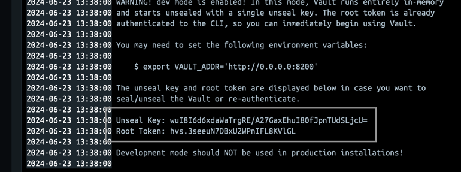
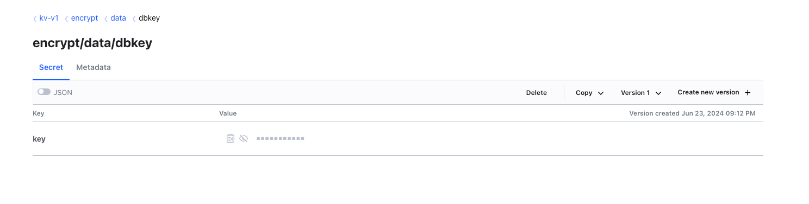

# MemberService

- port : 10010


# 서비스 정의
- 비즈니스에서 제공하는 멤버십(고객)서비스로서, 서비스에 가입하는 개인/고객 고객의 정보를 소유(ownership)하고 관련 정보의 변경에 대한 의무를 가진 서비스
- Membership(개인/법인)
  - membershipId : string
  - name : string
  - email : string
  - address : string
  - isValid : boolean
  - isCorp : boolean


## API
### 보안을 위한 API
- /membership/login 
  - 실제로 로그인을 하지는 않고 mebershipID에 대해서 JWT Token, Refresh Token을 발급
  - jwt token은 10초, refresh token은 30초로 설정
- /membership/refresh-token
  - refresh token을 활용하여 새로운 JWT Token을 발급하기 위한 API
- /membership/auth
  - jwt 토큰으로 고객을 특정하고, 인증하기 위한 API (사용자 정보 조회)


## Vault 설정
- Vault를 이용하여 저장된 key를 load하여 해당키를 이용해서 member의 email을 암호화하여 저장, 복호화하여 조회

    
1. 위의 이미지처럼 vault실행시에 노출되는 root token을 이용하여 `localhost:8200`접속
2. key 생성
      
    - vault의 키는 반드시 위의 그림과 같이 `kv-v1/encrypt/data/dbkey`로 생성해야 함. 다르게 할 경우 아래 policy 코드 변경 필요   
3. default policy 수정
      ```
      path "sys/mounts/kv-v1" {
        capabilities = ["update"] 
      }
      
      path "sys/mounts" {
         capabilities = ["read"] 
      }
      
      # write and manage secrets in key/value secrets engine
      path "kv-v1/*" {
        capabilities = ["create", "read", "update", "delete", "list"]
      }
      
      # Create policies to permit apps to read secrets
      path "sys/policies/acl/*" {
        capabilities = ["create", "read", "update", "delete", "list"]
      }
      
      # Create tokens for verifications & test
      path "auth/token/create" {
         capabilities = ["create", "update", "sudo"]
      }
      ```
4. console에서 수정된 policy 적용 -> `vault write auth/token/create policies=default`
   - vault에서 토큰을 생성하는데 위의 policy로 생성
   - console에서 실행시에 상단에 노출되는 client token 복사 (위의 token으로 서비스 접속시에 사용)  