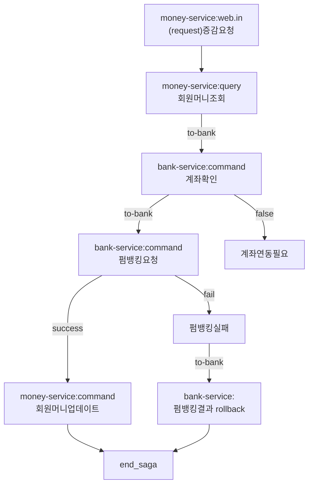

## 머니서비스
- 정의 : 고객의 선불 충전 금액(머니)을 관리하고, 이에 대해 다양한 쿼리르 제공할 수 있는 서비스
    - 특정 고객의 선불 충전금액(머니)를 관리(증액,감액)
    - 고객의 머니 변동 Command 관리, 정합성 유지
    - 특정 고객의 머니 변동 기록(입/출금) Query지원
    - 다양한 종류의 Query 지원

- MVP : 고객의 선불충전금액(머니)의 증액(충전)/감액 담당 및 기록
- API
  - Query
      - 고객의 머니 변동 기록 조회
      - 고객의 머니(잔액, 계좌연동정보) 조회
  - Command
      - 고객의 머니 증액(충전) 요청
      - 고객의 머니 감액(송금 등..) 요청

## EDA refactoring
1. Axon Server Setup
2. Dependency for AxonFramework. Connect to Axon Server(MoneyService)
3. Axon Adapter 패키지 생성, EventSourcing기반, MoneyService Refactoring
4. Axon Server Admin에서 EventSourcing 확인

## 사가패턴 적용 flow 
- endpoint : /money/increase-eda
- 조건
  - `member-service` member가 먼저 생성되어 있어야함
  - `bank-accoubt` bank-account가 먼저 생성되어 있어야함
  - `money-service` member-money가 먼저 생성되어 있어야함
