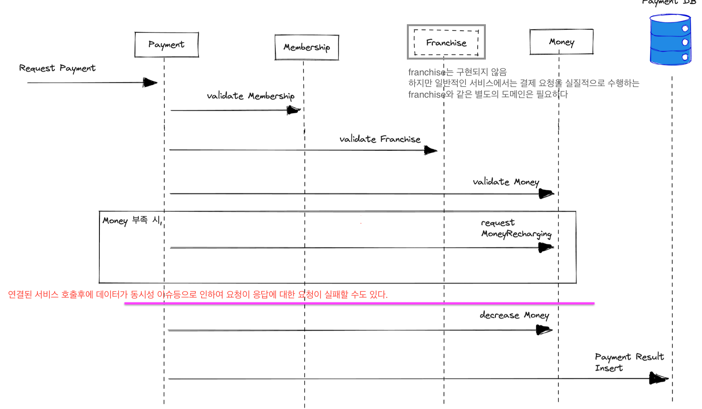

# 결제 서비스
- 결제라는 비즈니스 과정 전체를 관리하고, 트랜잭션에 대한 책임을 가지는 서비스
- 기능
  - 결제
  - 결제관련 유효성 체크
  - 결제취소
  - ...

## 결제 서비스 도메인 모델

## MVP 버전 기능
- 고객의 가맹점으로의 결제 요청을 받아서 처리하고, 정상 결제건들의 목록을 조회할 수 있는 서비스
  - 원칙적으로는 가맹점의 Aggregate를 정의하여 별도로 관리되어야 하나 생략한다.

## 결제서비스 sequence diagram

### PaymentRequest : 승인요청 도메인 모델
- requestMembershipId: string
- requestedPrice: number
- franchiseId: string
- franchisePaymentFeeRate: number
- paymentStatus: String - 승인/실패에 관해서만 관리. 원칙적으로는 요청등을 비롯해서 여러가지 상태가 있을 수 있음
- approvedTime: DateTime

### API
1. Command
   1. 결제요청 : request-payment
2. Query
   1. 정상결제건 조회 : find-normal-payments 

### 패키지 구조

    