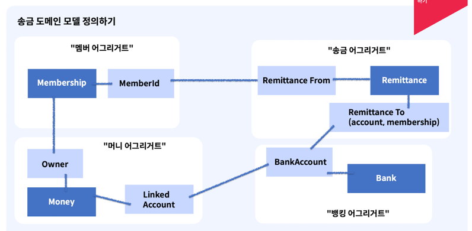
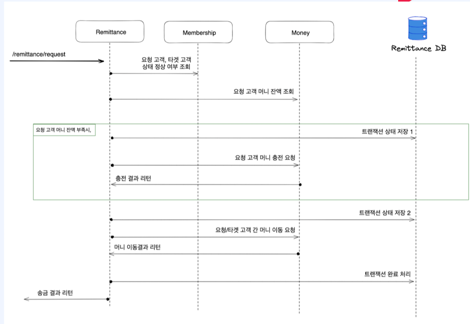
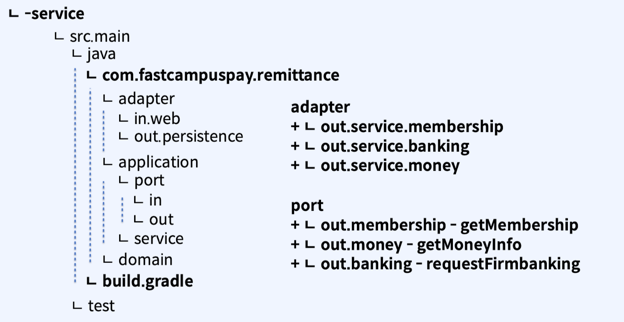

# 송금서비스
- "송금"이라는 비즈니스 과정 전체를 관리하고, 트랜잭션에 대한 책임을 가지는 서비스
- 송금과정 전체에 있어 트랜잭션 제공 (큐잉, 재시도 등의 다양한 패턴적용)
- 송금관련 기록에 대한 데이터 오너십이 있으며, 관련 데이터의 조회 서비스를 제공
## 송금서비스 도메인 모델

## MVP 버전
- 송금요청을 받아 처리하고, 이 이력을 조회할 수 있는 서비스
- 송금 : 요청한 고객이 자신의 머니잔액을 이용하여 다른고객 또는 외부 은행계좌에 돈을 보내는 작업
  - `요청한 고객` : 고객의 유효성 확인
  - `자신의 머니 잔액을 이용` : 머니잔액 확인, 부족시 충전
  - `다른 고객 또는 외부 은행계좌에` : 타인에게 돈을 보낼경우 잔액차감, 수신인은 머니 증액. 외부 은행계좌라면 고객의 머니차감 + 펌뱅킹수행
  - `작업` : 일련의 작업들을 기록하고 정합성을 관리

### 고객간 송금 Sequence Diagram

### API 식별
- Query : 고객의 송금 요청 상태에 대한 조회
  - find-remittanceHistory by membershipId
    - Request : membershipId
    - Response : RemittanceHistory Object
- Command : 고객의 송금 요청
  - request-remittance
    - Request : RemittanceRequest Object
    - Response : http code or response result

### 패키지 구조
